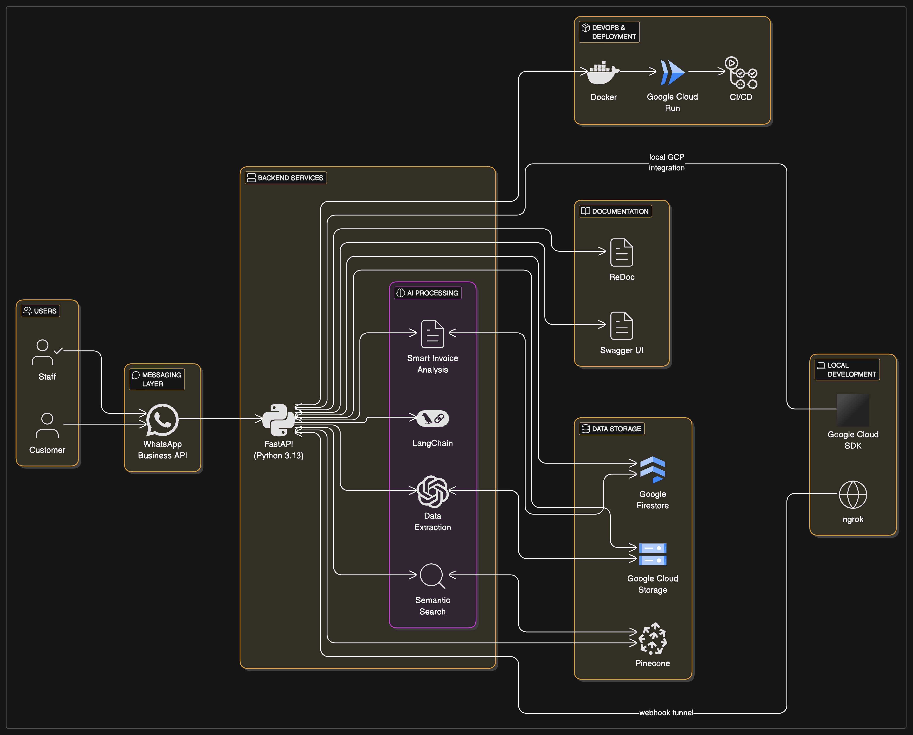

# WhatsApp AI Billing Bot: Revolutionize Your Invoice Management

[](https://github.com/vinaymavi/whatsapp-ai-billing-bot/actions/workflows/ci.yml)

<p align="center">
    
</p>

**Transform your billing process with AI-powered WhatsApp automation**

WhatsApp AI Billing Bot is an innovative solution that leverages artificial intelligence to streamline your billing and invoice management through WhatsApp – the messaging platform your customers already use every day.

## 🚀 Business Benefits

- **Save 75% of Staff Time** on manual invoice processing and data entry
- **Reduce Error Rates by 95%** compared to manual processing
- **24/7 Availability** for instant invoice management and customer inquiries
- **90% Faster Response Times** for billing-related customer questions
- **Seamless Integration** with your existing billing workflows and databases

## 💡 Key Features

- **Instant WhatsApp Processing** - Upload invoices and bills directly via WhatsApp for immediate analysis
- **AI-Powered Data Extraction** - Advanced algorithms automatically extract key information from documents
- **Smart Invoice Analysis** - Get detailed breakdowns and summaries of complex invoices
- **Multi-Format Support** - Process PDFs, Excel files, images, and text-based invoices
- **Secure Cloud Integration** - Enterprise-grade security with Google Cloud infrastructure
- **Semantic Search** - Find relevant information across your invoice history with natural language queries

## 🔧 Enterprise-Grade Technology

- **Communication Layer**: WhatsApp Business API integration for reliable, secure messaging
- **AI Intelligence**: Powered by OpenAI and LangChain for advanced natural language understanding
- **Scalable Backend**: Built on FastAPI and Python 3.13 for enterprise-level performance
- **Robust Data Storage**: Google Firestore for document data and Pinecone for vector embeddings
- **Secure Document Management**: Google Cloud Storage with enterprise security standards
- **Enterprise Deployment**: Containerized with Docker and deployed on Google Cloud Run with CI/CD

## Local Development
For development and testing purposes, you can run the application locally with an ngrok tunnel to receive WhatsApp webhooks:

```bash
ngrok http --url=renewed-selected-man.ngrok-free.app 8000
```

### Prerequisites

- Python 3.13
- Virtual environment (venv)
- Google Cloud SDK (optional for local GCP integration)
- WhatsApp Business API credentials

### Setup

1. Clone the repository:
```bash
git clone https://github.com/yourusername/whatsapp-ai-billing-bot.git
cd whatsapp-ai-billing-bot
```

2. Create a virtual environment:
```bash
python -m venv venv
source venv/bin/activate  # On Windows: venv\Scripts\activate
```

3. Install dependencies:
```bash
pip install -r requirements.txt
```

4. Set up environment variables:
```bash
cp example.env .env
# Edit .env with your actual configuration values
```

### Running the Application

```bash
# Run the application using uvicorn
python -m uvicorn app.main:app --reload --host 0.0.0.0 --port 8000

# Or use the VS Code task
# Press Ctrl+Shift+B or run the "Run Server" task
```

### Running Tests

```bash
# Run tests using pytest
python -m pytest tests -v

# Or use the VS Code task
# Run the "Run Tests" task
```

## Docker Setup

Deploy in minutes with our containerized solution:

```bash
# Build the Docker image
docker build -t whatsapp-ai-billing-bot .

# Run the container
docker run -p 8000:8000 --env-file .env whatsapp-ai-billing-bot
```

## Enterprise Deployment

This project includes comprehensive CI/CD setup with two deployment options:

### Option 1: GitHub Actions (Manual Deployment)
**Continuous Integration** (automatic on PRs and pushes to main):
- Automated backend and frontend unit tests
- Docker image build validation
- Quality checks before merging

**Deployment to Production** (manual trigger only):
- Controlled deployment to Google Cloud Run
- Zero-downtime updates
- Automatic scaling to match demand
- Enterprise-grade security compliance
- Cost-efficient infrastructure

See [DEPLOYMENT.md](DEPLOYMENT.md) for detailed instructions on setting up the GitHub Actions deployment pipeline.

### Option 2: Google Cloud Build Triggers (Automatic Deployment)
**Infrastructure for Automated CI/CD**:
- Terraform configuration for Cloud Build trigger infrastructure
- IAM permissions for Secret Manager, Cloud Build, and deployment
- Example trigger configurations you can customize
- Direct integration with Google Cloud Platform
- Built-in security with Secret Manager
- Faster builds with GCP infrastructure

See [docs/CLOUD_BUILD_TRIGGERS.md](docs/CLOUD_BUILD_TRIGGERS.md) for detailed instructions on setting up the infrastructure and creating your Cloud Build triggers.

## API Documentation

When the application is running, you can access the API documentation at:
- Swagger UI: http://localhost:8000/docs
- ReDoc: http://localhost:8000/redoc

## Why Choose WhatsApp AI Billing Bot?

| Feature | Traditional Solutions | WhatsApp AI Billing Bot |
|---------|----------------------|------------------------|
| Processing Time | Hours to days | Seconds to minutes |
| Error Rate | 5-15% | Less than 1% |
| Accessibility | Business hours only | 24/7 availability |
| User Interface | Complex software | Familiar WhatsApp chat |
| Integration | Requires IT department | Quick cloud setup |
| Scalability | Limited by staff | Unlimited AI processing |
| Cost | High operational costs | Predictable subscription |

## Contact Us

Ready to transform your billing process? Contact our sales team at sales@example.com for a personalized demo and pricing information.

---
© 2025 WhatsApp AI Billing Bot - Transforming business operations through AI
